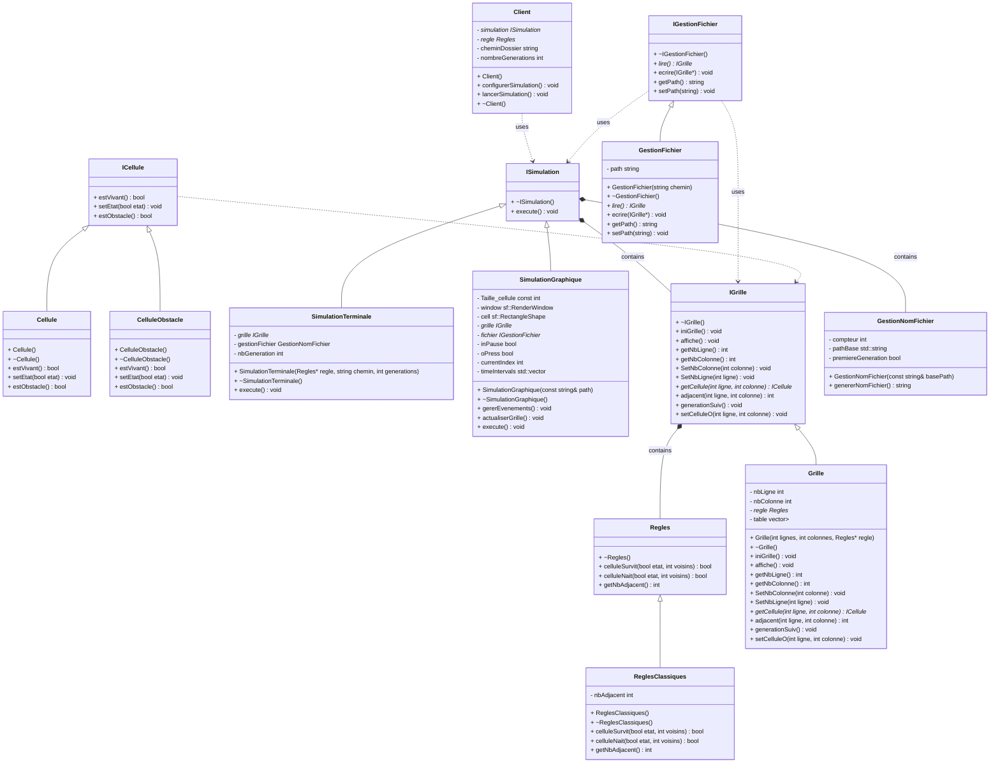

# projet Poo

## Diagramme classe



## Diagrammes Sequences

```mermaid
sequenceDiagram
    participant Client
    participant Regle
    participant SimulationTerminale
    participant Grille
    participant Cellule
    participant GestionNomFichier
    participant GestionFichier

    Client ->>+ Regle : Regle()
    Regle -->>- Client : objet crée
    Client ->> Client : choix simulation, nomfichier, nbGeneration
    Client ->>+ SimulationTerminale : Simulation(regle, chemin, nbGeneration)
    SimulationTerminale ->>+ Grille : Grille(nbLigne = 0, nbColonne = 0, Regle)
    Grille ->>+ Cellule : Cellule(), true
    Cellule -->>- Grille : objets crée
    Grille ->>- SimulationTerminale : objets crée
    SimulationTerminale ->>+ GestionNomFichier : GestionNomFichier
    GestionNomFichier -->>- SimulationTerminale : objets crée
    loop nbGeneration
        SimulationTerminale ->>+ GestionFichier : GestionFichier(GestionNomFichier)
        GestionFichier -->>- SimulationTerminale : objets crée
        SimulationTerminale ->>+ GestionFichier : Lire()
        GestionFichier -->>- SimulationTerminale : return grille
        SimulationTerminale ->>+ Grille : generationSuivante()
        Grille ->> Grille : Calcul prochaine grille
        Grille -->>- SimulationTerminale : actualise grille
        SimulationTerminale ->>+ GestionNomFichier : genererNomFichier()
        GestionNomFichier ->> GestionNomFichier : genere le prochain nom
        GestionNomFichier -->>- SimulationTerminale : actualise le nom
        SimulationTerminale ->>+ GestionFichier : setPath(nouveau nom)
        GestionFichier -->>- SimulationTerminale : change le path de l'objet fichier
        SimulationTerminale ->>+ GestionFichier : ecrire()
        GestionFichier ->> GestionFichier : ecrire dans le fichier txt
        GestionFichier -->>- SimulationTerminale : 
        SimulationTerminale ->>+ Grille : affiche()
        Grille -->>- SimulationTerminale : 
    end
    SimulationTerminale -->>- Client : ```


